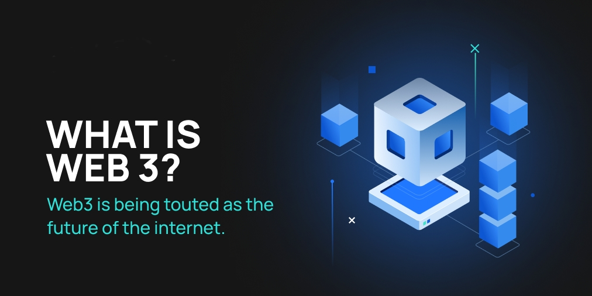

# Web3 related word and thier short Explanations
##  Author ##
👤 Adarsh Swaminath 
Twitter: <a href="https://mobile.twitter.com/adarshs002">@AdarshS002</a> 
LinkedIn: <a href="https://in.linkedin.com/in/adarsh-s-09935b240">AdarshS</a>
## 🤝 Contributing ##

Contributions,Issuses and feature request are welcome!
  Feel free to connect with me 

### 1. Blockchain: ### 
  A decentralized, distributed ledger that records transactions across many computers. 
### 2. Cryptocurrency: ###
  A digital asset that uses cryptography for secure financial transactions. 
### 3. Bitcoin: ###
  The first and most well-known cryptocurrency, based on a decentralized peer-to-peer network. 
### 4. Ethereum: ### 
  A decentralized, open-source blockchain platform that allows for the creation of smart contracts and decentralized applications (dApps). 
### 5. Smart contract: ###
  A self-executing contract with the terms of the agreement between buyer and seller being directly written into lines of code. 
### 6. Decentralized application (dApp): ###
  A software application that runs on a decentralized network rather than a single computer or server. 
### 7. Decentralized finance (DeFi): ###
  A financial system that operates on a blockchain or decentralized network. 
### 8. Non-fungible token (NFT): ### 
  A type of cryptocurrency that represents a unique asset, such as a digital collectible or artwork. 
### 9. Gas: ### 
  A unit of measurement for the amount of processing required to complete a transaction on the Ethereum network. 
### 10. Mining: ### 
  The process of verifying and adding transactions to a blockchain, and earning rewards for doing so. 
### 11. Proof of work (PoW): ###
  A consensus algorithm that requires miners to perform a certain amount of computational work in order to verify transactions and add them to the blockchain. 
### 12. Proof of stake (PoS): ###
  A consensus algorithm that requires validators to "stake" a certain amount of their own cryptocurrency in order to participate in the validation process. 
### 13. Private key: ###
  A unique, secret code that is used to access and control a cryptocurrency wallet. 
### 14. Public key: ###
  A unique, public code that is associated with a cryptocurrency wallet and used to receive transactions. 
### 15. Wallet: ###
  A software program that stores private and public keys and enables users to send and receive cryptocurrencies.  
### 16. Ledger: ###
  A record of financial transactions, such as those recorded in a blockchain. 
### 17. Consensus: ###
  The process of reaching agreement among the members of a decentralized network. 
### 18. Distributed ledger technology (DLT): ###
  A type of database that is spread across multiple computers or servers and allows multiple parties to securely record and share information. 
### 19. Permissioned blockchain: ###
  A blockchain that requires permission to access and participate in the network. 
### 20. Permissionless blockchain: ###
  A blockchain that does not require permission to access and participate in the network. 
### 21. Interoperability: ###
  The ability of different blockchain networks to communicate and exchange data with each other. 
### 22. Sidechain: ###
  A separate blockchain that is linked to a main blockchain, allowing assets to be transferred between the two chains. 
### 23. Cross-chain interaction: ###
  The ability of a blockchain to interact with and transfer assets to other blockchains. 
### 24. Atomic swap: ###
  A type of cross-chain transaction that allows users to exchange one cryptocurrency for another without the need for a centralized exchange. 
### 25. Hard fork: ###
  A change to the rules of a blockchain that is not backwards-compatible, resulting in a split into two separate chains. 
### 26. Soft fork: ### 
  A change to the rules of a blockchain that is backwards-compatible, allowing for a smooth transition to the new rules. 
### 27. Oracles: ###
  Third-party data sources that provide external information to smart contracts. 
### 28. Solidity: ### 
  A programming language for writing smart contracts on the Ethereum platform. 
### 29. Web3: ### 
  The third generation of the World Wide Web, which emphasizes decentralized technologies and protocols such as blockchain and peer-to-peer 
### 30. Peer-to-peer (P2P): ###
  A decentralized network architecture in which nodes communicate directly with each other rather than through a central server. 
### 31. Public blockchain: ###
  A blockchain that is open to anyone and allows anyone to participate in the network, validate transactions, and maintain the ledger. 
### 32. Private blockchain: ###
  A blockchain that is restricted to a certain group of participants and requires permission to access and participate in the network. 
### 33. Hybrid blockchain: ###
  A blockchain that combines elements of both public and private blockchains, allowing for a balance between decentralization and control. 
### 34. Distributed ledger: ###
  A ledger that is maintained and updated by a network of nodes rather than a central authority. 
### 35. Cryptography: ###
  The practice of secure communication through the use of codes and ciphers. 
### 36. Digital signature: ###
  A type of electronic signature that uses a private key to sign a message or document, providing proof of authenticity and integrity. 
### 37. Merkle tree: ###
  A data structure used in blockchain technology to verify the integrity of large sets of data. 
### 38. Hash function: ### 
  A mathematical function that takes an input and produces a fixed-size output, called a hash. 
### 39. Hash rate: ###
  The measure of a miner's processing power, expressed in hashes per second. 
### 40. 51% attack: ### 
  A hypothetical attack on a blockchain in which a group of miners or nodes control more than 50% of the network's computing power, allowing them to manipulate the ledger and potentially double-spend coins. 
### 41. Replay attack: ### 
  An attack in which a transaction on one blockchain is "replayed" on another blockchain, potentially resulting in unintended consequences. 
### 42. Sybil attack: ###
  An attack in which a malicious actor creates multiple fake identities in order to gain control of a decentralized network. 
### 43. Denial of service (DoS) attack:### 
  An attack in which a network or system is flooded with traffic or requests, rendering it unavailable to legitimate users. 
### 44. Oracle problem: ### 
  The challenge of bringing external data into a blockchain, in order to trigger the execution of a smart contract. 
### 45. Tokenization: ### 
  The process of representing a real-world asset or commodity as a digital token on a blockchain. 
### 46. Token economics: ### 
  The study of the design and behavior of tokens within a particular blockchain ecosystem. 
### 47. Utility token:### 
  A type of token that represents the right to use a particular service or product. 
### 48. Security token: ### 
  A type of token that represents ownership of an asset, such as stock or real estate. 
### 49. Governance token: ### 
  A type of token that gives holders the right to participate in decision-making processes within a decentralized organization. 
### 50. DAO (Decentralized Autonomous Organization): ### 
  A decentralized organization that is governed by smart contracts and run by its members. 
